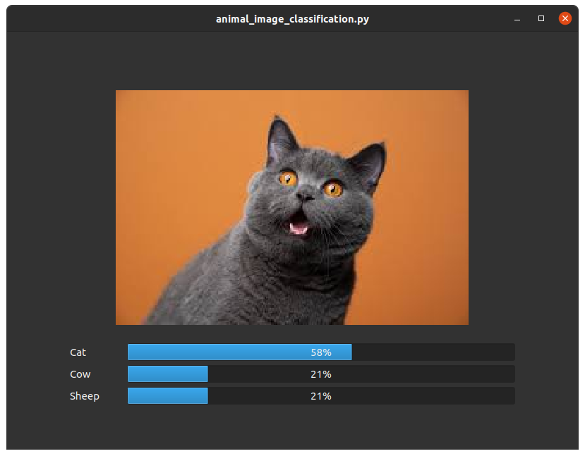

# Animal Image Classification

CNN model trained to classify 3 types of images 
1. Cats
2. Cows
3. Sheep

### Dataset
Images were taken from Animal-10 dataset
Link: https://www.kaggle.com/datasets/alessiocorrado99/animals10

### Quick explanation
The model hsa 85% accuracy with image size 64x64.

Newly trained model will be saved to saved_models/model if none already exist

Images can be put to dataset/manual_test to appear in UI presentation and display model prediction with the image like shown below

### UI Snapshots

